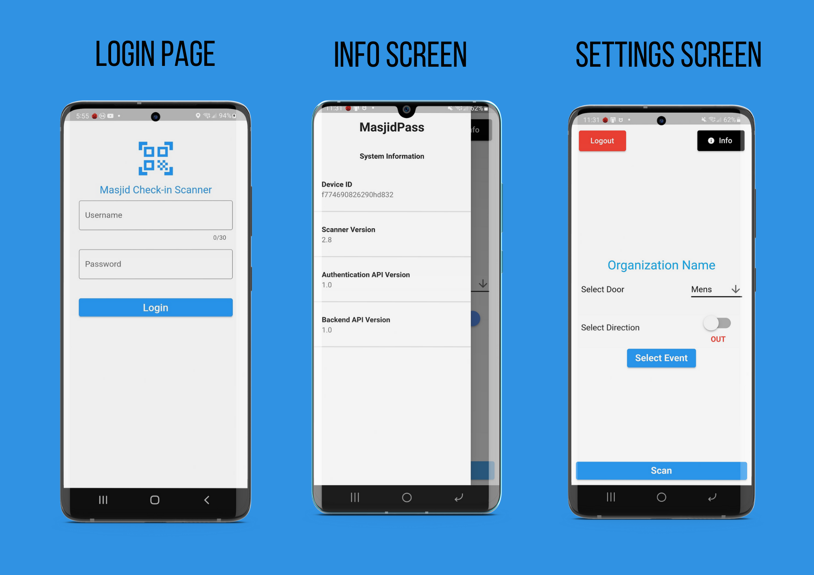
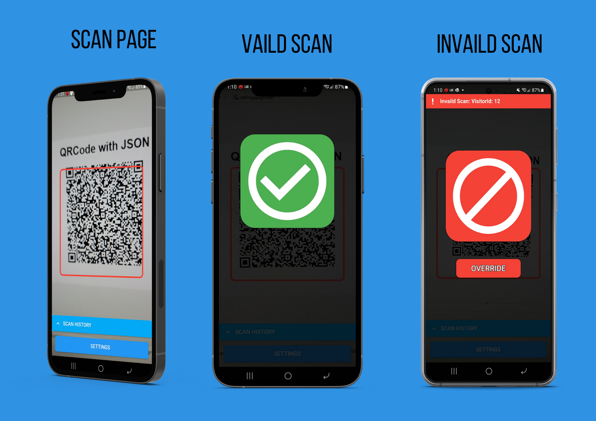

<!-- PROJECT LOGO -->
 

  <h2 align="center">MasjidPass Project</h2>

<!-- ABOUT THE PROJECT -->
## About The Project
### Qr Scanning Application 

MasjidPass is an open source project to facilitate Covid tracing and pre-booking for prayers at Mosques (Masajid)

### Built With
* Flutter
* Dart
* Sqlite
* Android Studio

  <h3 align="center">Login & Setting Page</h3>
  
   <h3 align="center">Scan Page</h3>
  

